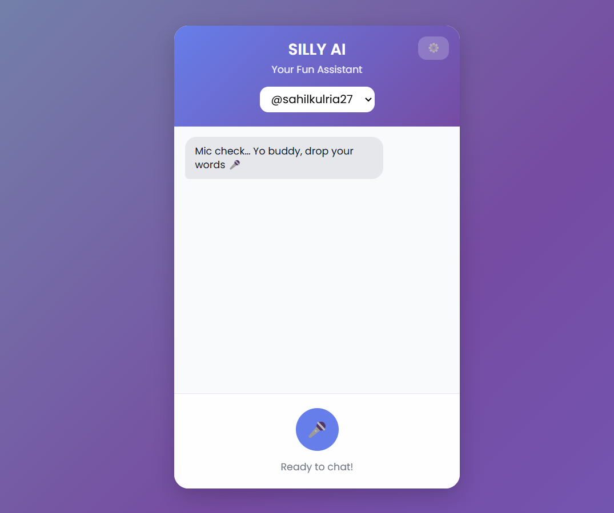
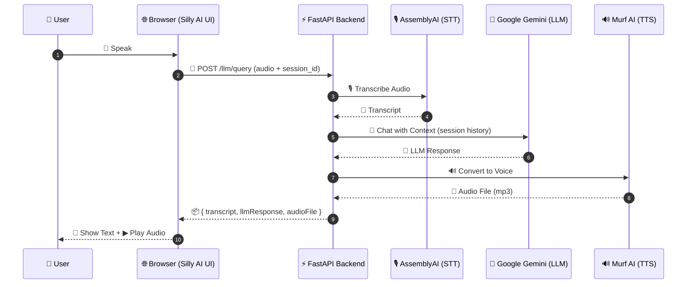

<p align="center">
  
</p>

<h1 align="center">🎭 Silly AI — Smart Interactive Light-hearted Language Yielding AI :) </h1>

<p align="center">
  A quirky, PWA-ready voice assistant that listens, laughs, and replies with style.  
  <br/>Speak naturally, get witty responses, hear lifelike voice replies, and enjoy a playful UI.  
  <br/><b>Because serious AIs are boring!</b> ✨
</p>

<p align="center">
  <a href="https://img.shields.io/badge/Python-3.10%2B-3776AB?logo=python&logoColor=white"></a>
  <a href="https://img.shields.io/badge/FastAPI-⚡-009688?logo=fastapi&logoColor=white"></a>
  <a href="https://murf.ai/">
  </a>
  <a href="https://ai.google/">
  </a>
  <a href="https://serpapi.com/">
  </a>

---

## ✨ Highlights

- 🎤 **Conversational voice chat** with fun personality  
- 📝 **Text-only chat** for quick testing  
- 🔊 **Speech-to-text & lifelike voice replies**  
- 🎨 **Playful, animated UI** with smooth interactions  
- 🔐 **API key config** via `.env` or in-app settings  

<div align="center">
  
  <br/>
</div>

---

## 🧭 Table of Contents

1. [Quickstart](#-quickstart)
2. [Environment & Config](#-environment--config)
3. [Architecture](#-architecture)
4. [Core Features](#-core-features)
5. [Project Structure](#-project-structure)
6. [Deployment](#-deployment)
7. [License](#-license)

---

## 🚀 Quickstart

### Prerequisites
- Python 3.10+  
- API keys for Speech-to-Text, LLM, and TTS  


python -m venv .venv
source .venv/bin/activate   # macOS/Linux
. .\.venv\Scripts\Activate.ps1  # Windows

# Install deps
pip install -r requirements.txt

# Add your keys to .env

## 🔐 Environment & Config

Create a `.env` file inside `uploads/`:

```env
ASSEMBLYAI_API_KEY=your_key
GEMINI_API_KEY=your_key
MURF_API_KEY=your_key
SECRET_KEY=optional_secret_for_encryption

```

### 🧩 Architecture  



---

### **Quick Start (Installation Guide)**
```markdown
## 🚀 Quick Start

```bash
# Clone repo
git clone https://github.com/your-username/silly-ai.git
cd silly-ai

# Install dependencies
npm install

# Run backend
cd backend
npm start

# Run frontend
cd frontend
npm start

```

## 🧱 Core Features

🎤 Voice & Text Chat → Speak or type, Silly AI replies

🧠 Session Memory → Context preserved for ongoing chats

🔗 Speech Pipeline → AssemblyAI (STT) → Gemini (LLM) → Murf (TTS)

😎 Playful Persona → Replies with humor & casual tone

📱 PWA Ready → Works on desktop & mobile, installable as an app

---

### **Project Structure**
```markdown
## 📂 Project Structure

Silly-AI/
├─ app.py                # FastAPI app
├─ config.py             # Config & key mgmt
├─ schemas.py            # Pydantic models
├─ services/             # API integrations (STT, LLM, TTS)
├─ templates/            # HTML frontend
├─ static/               # JS, CSS, icons
├─ uploads/              # User configs & data
├─ image/                # Logo & screenshots
├─ requirements.txt      # Python deps
├─ Dockerfile            # Deployment
└─ README.md             # You are here

```


## ☁️ Deployment
▶ Local
uvicorn app:app --host 0.0.0.0 --port 8000 --reload

## 🐳 Render / Docker
docker build -t silly-ai .
docker run -p 8000:8000 silly-ai


## 🚀 Live Demo
🔗 [Click here to try SillyAI](https://silly19-ai.onrender.com)

## 📄 License

MIT License © 2025 Sahil Kulria
